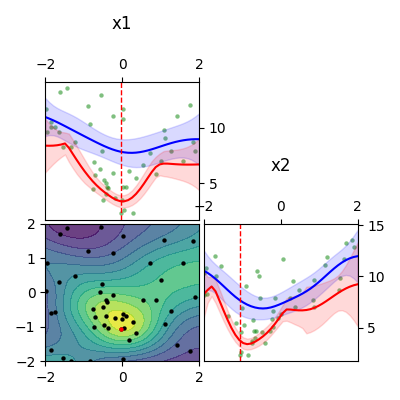

ggga
====

| **Gaussian Process Guided Genetic Algorithm**
| *for optimization of expensive noisy black box functions or
  hyperparameter tuning*

Synopsis
--------

.. code:: python

   from ggga import *
   import asyncio
   import numpy as np

   # 1. Define the parameter space we want to optimize.
   #    Here, a R² space.

   space = Space(
       Real('x1', -2, 2),
       Real('x2', -2, 2))

   # 2. Define the objective function we want to optimize.
   #    Here, the Goldstein-Price function with some noise
   #    and a log(y+1) transformation of the value.

   from ggga.benchmark_functions import goldstein_price

   async def objective(x, rng):
       y = goldstein_price(*x)
       y_with_noise = y + rng.normal(scale=10)
       while y_with_noise < 0:
           y_with_noise = y + rng.normal(scale=10)
       value = np.log(1 + y_with_noise)
       cost = 0.0
       return value, cost

   # 3. Choose optimization settings.

   minimizer = Minimizer(
       max_nevals = 50,
   )

   # 4. Kick of the optimization.
   #    The result contains all evaluations

   rng = RandomState(1234)  # choose seed for reproducibility
   loop = asyncio.get_event_loop()
   res = loop.run_until_complete(minimizer.minimize(
       objective, space=space, rng=rng))

   # 5. Visualize the result.

   from ggga.visualization import PartialDependence
   fig, _ = PartialDependence(model=res.model, space=space, rng=rng) \
       .plot_grid(res.xs, res.ys)
   fig.savefig("README_example.png")

The visualization shows all samples
and the response surface of a Gaussian Process Regression
fitted to those samples.
The optimum of the Goldstein-Price function is at (0, -1).
Each column shows one parameter (x1 and x2),
in between them the interactions between the parameters with a contour plot.
The individual parameter plots view the surface from one side.
The blue line is the *average* value of the surface along that parameter,
with a ±2σ region around it.
The red line is the *minimal* value of the surface along that parameter,
also with a ±2σ region.
The best sample is marked with a dashed line (individual plots)
or a red dot (interaction plot).
However, the best found sample might not be at the optimum, due to noise.

Example objective function that runs an external program:

.. code:: python

   async def objective(x, rng):
       # set up the command to execute
       # like: `./someprogram --x1=1.978 --x2=-0.471`
       command = ['./someprogram']
       for param, value in zip (space.params, x):
           command.append(f"--{param.name}={value}")

       # run the command
       process = await asyncio.subprocess.create_subprocess_exec(
           *command, stdout=asyncio.subprocess.PIPE)
       out, err = await process.communicate()

       # parse the output
       value = float(out.decode().splitlines()[-1])
       cost = 0.0  # or could measure CPU-time
       return value, cost

Description
-----------

GGGA is an optimization algorithm
that combines evolutionary algorithms with Bayesian optimization.
It is suitable for optimizing expensive black-box functions with noise.
In particular, it may be used for hyperparameter tuning
of machine learning algorithms.

Related work:

-  `scikit-optimize <https://scikit-optimize.github.io/>`__:
   an implementation of Bayesian optimization, implemented in Python.
-  `irace <https://cran.r-project.org/web/packages/irace/index.html>`__:
   a parameter tuning tool using iterated racing, implemented in R.

Installation
------------

GGGA requires Python 3.6 or later, and an up to date Scipy stack
(numpy, scipy, matplotlib, pandas, scikit-learn).

Installation can be performed directly from the GitHub repository:

::

   $ pip install git+https://github.com/latk/ggga.py.git

Alternatively, build the container from the Dockerfile.

Examples
--------

The ``ggga`` module is also a command line tool
to explore various benchmark functions.
By default, GGGA is compared to random samples.

::

   $ python3 -m ggga --help

Run the example from the Synopsis:

::

   $ python3 -m ggga goldstein-price --logy --samples=50 --noise 10

Minimizer
---------

*class ggga.Minimizer*

Configure the GGGA optimizer.

Attributes:

-  **popsize**: int = 10.
   How many samples are taken per generation.
-  **max_nevals**: int = 100.
   How many samples may be taken in total per optimization run.
-  **relscale_initial**: float = 0.3.
   Standard deviation for creating new samples,
   as percentage of each parameter's range.
-  **relscale_attenuation**: float = 0.9.
   Factor by which the relscale is reduced per generation.
-  **surrogate_model_class**: Type[`SurrogateModel`_] = ggga.SurrogateModelGPR.
   The regression model to fit the response surface.
-  **surrogate_model_args**: dict = {}.
   Extra arguments for the surrogate model.
-  **acquisition_strategy**: Optional[`AcquisitionStrategy`_].
   How new samples are acquired.
   Defaults to MutationAcquisition(breadth=10).
-  **select_via_posterior**: bool = False.
   Whether the model prediction should be used as a fitness function
   when selecting which samples proceed to the next generation.
   If false, the objective's value incl. noise is used.
-  **fmin_via_posterior**: bool = True.
   Whether the model prediction is used
   to find the current best point during optimization.
   If false, the objective's value incl. noise is used.
-  **n_replacements**: int = 1.
   How many random samples are suggested per generation.
   Usually, new samples are created by random mutations of existing samples.

**with_setting**\ (\**kwargs) -> Minimizer:

Clone a minimizer but override some attributes.

async **minimize**\ (objective, \*, space, rng, outputs?) ->
`OptimizationResult`_:

Minimize the objective.

-  async **objective**\ (sample, rng) -> (value, cost).
   A function to calculate the objective value.
   The *sample* is a list with the same order as the params in the space.
   The *value* and *cost* are floats. The cost is merely informative.
-  **space**: `Space`_.
   The parameter space inside which the objective is optimized.
-  **rng**: numpy.random.RandomState.
-  **outputs**: `OutputEventHandler`_ = <...>.
   Controls what information is printed during optimization.
   Can e.g. be used to save evaluations in a CSV file.
   Defaults to `Output`_.

OptimizationResult
------------------

*class ggga.OptimizationResult*

**best_individual**: `Individual`_

**best_n**\ (how_many: int) -> List[`Individual`_]

**model**: `SurrogateModel`_

**xs**: ndarray

**ys**: ndarray

**fmin**: float

Individual
----------

*class ggga.Individual*

**sample**: list

**observation**: float

**cost**: float

**gen**: float

**expected_improvement**: float

**prediction**: float

**is_fully_initialized**\ () -> bool

Space
-----

.. _Integer: Space_
.. _Real: Space_

*class ggga.Space*

Represents the parameter space inside which optimization is performed.

**Space**\ (\*params):

-  *params*. The parameters that make up the space.

Parameters:

-  class **Integer**\ (name, lo, hi)
-  class **Real**\ (name, lo, hi, \*, scale?)

SurrogateModel
--------------

*interface ggga.SurrogateModel*

A regression model to predict the value of points.
This is used to guide the acquisition of new samples.

This class defines an interface,
which is implemented by SurrogateModelGPR and SurrogateModelKNN.

abstract classmethod **estimate**\ (mat_x, vec_y, \*, space, rng, prior?, \**kwargs) -> SurrogateModel:

Fit a new model to the given data.

-  **mat_x**: ndarray.
-  **vec_y**: ndarray.
-  **space**: `Space`_.
-  **rng**: RandomState.
-  **prior**: Optional[SurrogateModel].
-  **\**kwargs**. Extra arguments for the concrete SurrogateModel class.

**predict**\ (vec_x, \* return_std?) -> (mean, std?)

**predict_a**\ (mat_x, \* return_std?) -> (vec_mean, vec_std?)

abstract **predict_transformed_a**\ (mat_x_transformed, \*, return_std?) -> (vec_mean, vec_std?)

**length_scales**\ () -> ndarray

AcquisitionStrategy
-------------------

*interface ggga.acquisition.AcquisitionStrategy*

A strategy to acquire new samples.

abstract **acquire**\ (population, \*, model, relscale, rng, fmin, space) -> Iterator[Individual]

**Implementations:**

-  class **ChainedAcquisition**\ (\*strategies):
   Perform multi-stage acquisition,
   with each stage operating on the results of the previous stage.
-  class **HedgedAcquisition**\ (\*strategies):
   Randomly assign parent individuals to a sub-strategy.
-  class **RandomReplacementAcquisition**\ (\*, n_replacements, subacquisition, hedge_via_prediction?, relscale_initial?):
   Replace bad samples with random samples.
-  class **MutationAcquisition**\ (breadth)
-  class **RandomWalkAcquisition**\ (breadth, steps, relscale_attenuation?):
   Randomly mutate parent samples to create new samples in their neighborhood.
-  class **GradientAcquisition**\ (breadth):
   Use gradient optimization to find optimal samples.

OutputEventHandler
------------------

*interface ggga.OutputEventHandler*

Report progress and save results during optimization progress,

**event_new_generation**\ (gen, \*, relscale)

**event_evaluations_completed**\ (individuals, \* duration)

**event_model_trained**\ (generation, model, \* duration)

**event_acquisition_completed**\ (\*, duration)

Output
------

*class ggga.Output*

Default implementation of `OutputEventHandler`_.

**Output**\ (\*, space, evaluation_csv_file?, model_file?, log_file?):

-  *space*: `Space`_.
-  *evaluation_csv_file*: Optional[TextIO] = None.
   If provided, will write evaluation results to a CSV file.
-  *model_file*: Optional[TextIO] = None.
   If provided, will write trained models as JSON documents to that file.
-  *log_file*: Optional[TextIO] = stdout:
   If provided, will write human readable output to that file.

**acquisition_durations**: List[float]

**evaluation_durations**: List[float]

**training_durations**: List[float]

**add**\ (logger):

Add another `OutputEventHandler`_.

PartialDependence
-----------------

*class ggga.visualization.PartialDependence*

Make visualizations that analyze individual contributions of each parameter.

**PartialDependence**\ (\*, model, space, rng, resolution, quality):

-  **model**: `SurrogateModel`_.
-  **space**: `Space`_.
-  **rng**: RandomState.
-  **resolution**: int = 40.
   How many samples are used along one
   parameter.
-  **quality**: int = 250.
   How many samples are used along all other parameters
   to get a precise estimate of average value.

**along_one_dimension**\ (dim):

Calculate contributions along one dimension.

**along_two_dimensions**\ (dim_1, dim_2):

Calculate contributions along two dimensions.

**plot_grid**\ (x_observed, y_observed, \*, x_min?, style?, progress_cb?):

Plot a visualization of parameter influences.

-  **x_observed**: ndarray.
-  **y_observed**: ndarray.
-  **x_min**: list = <...>.
   Minimum sample. Defaults to the sample that minimizes *y_observed*.
-  **style**: `DualDependenceStyle`_ = <unspecified>.
-  **progress_cb**\ (dim_1_name, dim_2_name?) -> None:
   Called prior to rendering each sub-plot
   with the names of the parameters in the sub-plot.
   The *dim_2_name* is only provided for interaction plots.

Returns: (*fig*, *axes*): The plotted figure.

DualDependenceStyle
-------------------

*class ggga.visualization.DualDependenceStyle*

Control the appearance of the parameter interaction visualization.

The interaction (contour) plot has four layers
that can be configured separately:

-  filled contour plot (**get_contour_filled_args()**)

   1. locator: None, cmap: *cmap*, alpha: 0.8
   2. *contour_args*
   3. *contour_filled_args*

-  contour lines (**get_contour_line_args()**)

   1. locator: None, colors: 'k', linewidths: 1
   2. *contour_args*
   3. *contour_filled_args*

-  scatter plot of all samples (**get_scatter_args()**)

   1. c: 'k', s: 10, lw: 0
   2. *scatter_args*

-  “scatter” plot of the best sample (**get_xmin_scatter_args()**)

   1. *get_scatter_args()*
   2. c: 'r'
   3. *xmin_scatter_args*

**cmap**: str = viridis_r.
The colour map used for the filled contour plot

**contour_args**: Optional[dict] = None.
Extra arguments for the contour plot (both filled and lines).

**contour_filled**: bool = True.
Whether filled contours are drawn.
Either this or *contour_lines* should be true.

**contour_filled_args**: Optional[dict] = None.
Extra arguments for the filled contour plot, overrides *contour_args*.

**contour_levels**: int = 10.

**contour_lines**: bool = False.
Whether contour lines are drawn.
Either this or *contour_filled* should be true.

**contour_filled_args**: Optional[dict] = None.
Extra arguments for the line contour plot, overrides *contour_args*.

**contour_scatter_args**: Optional[dict] = None.
Extra arguments for the scatter plot of all samples.

**xmin_scatter_args**: Optional[dict] = None.
Extra arguments to override the scatter plot appearance of the best point.

**subplot_size**: float = 2.0.
How large each plot in the grid of all parameters should be.
The whole figure will have size (*n_params* × *subplot_size*)².

benchmark_functions
-------------------

*module ggga.benchmark_functions*

A collection of optimization benchmark functions
that can be used via the example runner.
Some of them do not have a fixed number of parameters
and can be implicitly used as any n-dimensional version.
Read their docstrings for more information on behaviour, bounds, and optima.

**goldstein_price**\ (x_1, x_2)

**easom**\ (x_1, x_2, \*, amplitude?)

**himmelblau**\ (x_1, x_2)

**rastrigin**\ (\*xs, amplitude?)

**rosenbrock**\ (\*xs)

**sphere**\ (\*xs)

**onemax**\ (\*xs)

**trap**\ (\*xs, p_well?)

Example optimization strategies
-------------------------------

The example runner can receive a number of optimization strategies to compare.
These can be selected and configured on the command line.
To configure a strategy, provide a YAML document with type tags,
e.g. ``!GGGA { ... }``.

-  ``random``: take random samples.

-  ``ggga``: use GGGA for optimization.

-  ``!GGGA { ... }``: use GGGA for optimization.
   The mapping may provide extra arguments for the
   `Minimizer`_.
   The Minimizer's *nevals* and *surrogate_model_class* arguments
   should be specified via the example runner's --samples and --model flags.
   All acquisition strategies can be specified through YAML.

-  ``!Irace { ... }``: use irace for optimization.

   -  **port**: int.
      Required for communication between the objective function and irace.
   -  **parallel**: int = 1.
      How many evaluations may be performed in parallel.
   -  **digits**: int = 4.
      Internal precision used by irace.
   -  **min_racing_rounds**: int = 2.
      Racing rounds before the first statistical test is applied.
      By default, irace uses 5 rounds here.
   -  **confidence**: float = 0.95.
      Confidence level for the statistical test during racing.

Stability Policy
----------------

The API is unstable and may change at any time without prior notice.

Acknowledgements
----------------

Development of this software was supported by the
Workgroup for Network Security, Information, and Data Security
at the Frankfurt University of Applied Sciences
(GH: `@fg-netzwerksicherheit <https://github.com/fg-netzwerksicherheit>`__,
Homepage: `Forschungsgruppe für
Netzwerksicherheit, Informationssicherheit und Datenschutz
<http://netzwerksicherheit.fb2.fh-frankfurt.de/>`__)

License
-------

Copyright 2018 Lukas Atkinson

GGGA is licensed under the terms of the AGPLv3+,
see the LICENSE.txt for details.
