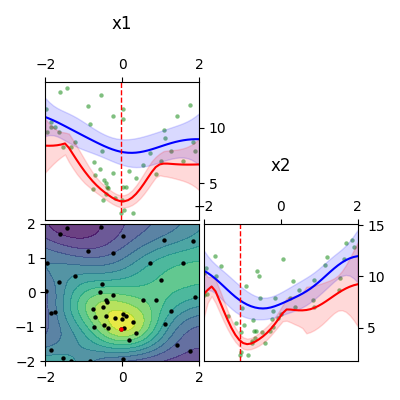

.. include:: ../../README.rst
    :start-after: .. begin contents
    :end-before: .. end contents

Contents
========

.. toctree::
   :maxdepth: 2
   :caption: Contents:

   Overview <self>
   man
   api

Indices and tables
==================

* :ref:`genindex`
* :ref:`modindex`
* :ref:`search`
